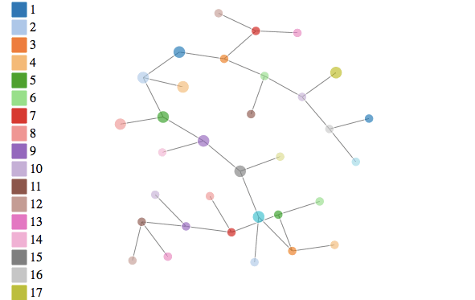

# decision-tree
A decision tree calssifier for use on vectors of real-values.

# Usage

Just install the package using the `devtools` package in `R`.

```
devtools::install_github("davidrdgz/unitree")
```

Then you can go ahead and run a quick test on the iris data set as follows,

```
Y  <- iris[,5]
X  <- iris[,1:4]
dt <- unitree(X, Y)
```

That should fit out univariate decision tree. In this case we have constructed
a tree with Gaussian threshing and impurity measure using information criteria. Now we can make some silly predictions (silly because we fit the tree with this data),

```
> p  <- u.predict(dt, X)
> table(pred = p, actu = Y)

actu
pred         setosa versicolor virginica
setosa         50          0         0
versicolor      0         50         0
virginica       0          0        50
```

So we see that our univariate decision tree classifies the iris data set. Further, we can take a look at our tree,




# Why
This package is intended for those trying to classifying signals from sensors. In particular, this package gives the capability to make

- Trees
- Forests

Additionally, there are a variety of options to speed up the process of finding the best splitting point over each signal. These techniques are coined _threshing_ and include:

- Gaussian
- K-Tile
- Uniform

approximation techniques.

# Plot

This package include a D3 graphic capability known as a _force-graph_. This graph has labels identifying the node id, the column from `x` used to split the node and the `label` of the node and percent of the node with the given label.


# Desired Features
Currently this package does not support, but we hope to implement in the future.

1. Pruning Methods

